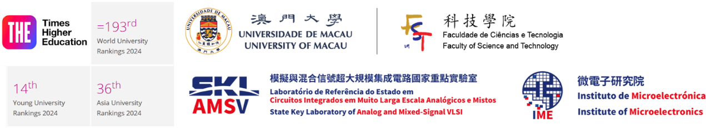

<!--
---
layout: home
title: "Pui-In Mak (Elvis) 麦沛然"
author_profile: false
redirect_from: 
  - /about/
  - /about.html
---

<!-- 个人信息部分 -->

  
  

    
IEEE Fellow | IET Fellow | RSC Fellow 

    
Foreign Academician, Academy of Sciences of Lisbon, Portugal

    
Overseas Expert, Chinese Academy of Sciences

    
Visiting Chair Professorship, Chinese Ministry of Education

  
    
Editor-in-Chief, IEEE Solid-State Circuits Letters (2024-2026)

    
ISSCC 70th Anniversary Top Contributing Authors (2023)

    
Tencent Xplorer Prize (2022)

    
National Science and Technology Progress Award (2011)

  
    
<strong>Full Professor</strong>

    
<a href="https://www.fst.um.edu.mo/ece/" style="text-decoration: none;">Faculty of Science & Technology - ECE</a>, <a href="https://www.um.edu.mo/" style="text-decoration: underline;">University of Macau</a> (UM), Macau, China 

  

<!-- 全宽图片 -->

  

<!-- 全宽文本内容 -->

  
IEEE Fellow | IET Fellow | RSC Fellow

  
Foreign Academician, Academy of Sciences of Lisbon, Portugal

  
Overseas Expert, Chinese Academy of Sciences

  
Visiting Chair Professorship, Chinese Ministry of Education

  
Editor-in-Chief, IEEE Solid-State Circuits Letters (2024-2026)

  
ISSCC 70th Anniversary Top Contributing Authors (2023)

  
Tencent Xplorer Prize (2022)

  
National Science and Technology Progress Award (2011)

  
<strong>Full Professor</strong>

  
<a href="https://www.fst.um.edu.mo/ece/" style="text-decoration: none;">Faculty of Science & Technology - ECE</a>, <a href="https://www.um.edu.mo/" style="text-decoration: underline;">University of Macau</a> (UM), Macau, China

  
<strong>Director</strong>

  
<a href="https://ime.um.edu.mo/" style="text-decoration: none;">State-Key Laboratory of Analog & Mixed-Signal VLSI</a>, UM, Macau, China

  
<strong>Deputy Director (Research)</strong>

  
<a href="https://ime.um.edu.mo/" style="text-decoration: none;">Institute of Microelectronics</a>, UM, Macau, China

  
<strong>Co-Founder</strong>

  
<a href="https://www.digifluidic.com/" style="text-decoration: none;">DigiFluidic Biotech Ltd</a>, China

  
Email: pimak_at_umac.mo

  
University Page: <a href="https://www.fst.um.edu.mo/people/pimak/">https://www.fst.um.edu.mo/people/pimak/</a>

  
  
<strong>Pui-In Mak (Elvis)</strong> was born in Macau ('79), and raised there with his early education in Escola de Santa Teresa and Instituto Salesiano. He received the B.Sc. ('03) and Ph.D. ('06) degrees from the University of Macau (UM), where he is currently Full Professor at the Faculty of Science and Technology (FST) - Electrical and Computer Engineering (ECE); Director at the State-Key Laboratory of Analog and Mixed-Signal VLSI, and Deputy Director (Research) at the Institute of Microelectronics. He was a Clare-Hall Visiting Fellow ('09) of the University of Cambridge, UK. His research focuses are on circuits and systems for wireless and multidisciplinary innovations. He has advised/is advising 60+ graduate students and 20+ researchers (RA/post-doc).

  
He co-developed 39 state-of-the-art chips which are reported consecutively at the 2011-2024 IEEE International Solid-State Circuits Conference - ISSCC (Chip Olympics), of which 10 are ISSCC Highlight Papers. His graduates are with universities and companies developing cutting-edge research/products for a wide variety of applications like 5G-NR, precision analog, IoE connectivity and automotive.

  
His group pioneered the Intelligent Digital Microfluidic (iDMF) platform and micro-Nuclear Magnetic Resonance (micro-NMR) platform for biological/chemical diagnostics. They led to many multidisciplinary publications in the journals like Nature Communications, Nature PG - Microsystems & Nanoengineering, Scientific Reports, RSC Lab on a Chip, RSC Analyst, ACS Analytical Chemistry, ACS Sensors, Oxford Bioinformatics, Elsevier Biosensors and Bioelectronics, Elsevier Sensors and Actuators. In 2018, the group founded the DigiFluidic Biotech Ltd. for commercializing the iDMF platform for virus screening and food-quality monitoring.

  
Prof. Mak has co-authored ~520 publications (11 books/book chapters, ~280 journal papers and ~230 conference papers) and holds 35+ patents (issued/filed). He has delivered >120 lectures as keynotes (PRIME'16, RFID-TA'16, ICAC'19, ICTA'19, APCCAS'21, ICICM'22, ICICM'23), industrial seminars (Qualcomm'17, imec'17) and tutorials/short courses (ISCAS'12, APCCAS'12, VLSI-DAT'15, ACTS'20).

  
He is the Editor-in-Chief of the IEEE Solid-State Circuits Letters - SSCL ('24-Present). He was the Editorial Board Member of IEEE Press ('14-'16); Senior Editor of IEEE Journal on Emerging and Selected Topics in Circuits and Systems - JETCAS ('14-'15); Associate Editor of IEEE Journal of Solid-State Circuits - JSSC ('18-'24), IEEE Solid-State Circuits Letters - SSCL ('17-'23), IEEE Transactions on Circuits and Systems I - TCAS-I ('10-'11, '14-'15), IEEE Transactions on Circuits and Systems II - TCAS-II ('10-'13) and IOP Journal of Semiconductors - JOS ('21-'23); Guest Editor of IEEE RFIC Virtual Journal ('14), JSSC ('18), JETCAS ('18) and IEEE Sensors Journal ('19). For IEEE conferences, he was the TPC Vice Chair of ASP-DAC ('16), TPC Member of ISSCC ('17-'19), ESSCIRC ('16-'17) and A-SSCC ('13-'16, '19).

  
He co-received numerous paper awards in leading conferences, e.g. RFIC'21, APCCAS'19, ISSCC-SRP'19, IMCO'19, ISSCC’16, A-SSCC’15, ASQED’13, APCCAS’08, DAC/ISSCC’05, MWSCAS’04 and ASICON'03. He co-received the IEEE/CEDA Outstanding Service Award’17; IEEE CASS Outstanding Young Author Award’10; IEEE CASS Chapter-of-the-Year Award’09; IEEE MGA GOLD Achievement Award’09 and Best Associate Editor of TCAS-II’12-’13. His students received 7 SSCS Predoctoral Achievement Awards.

  
Prof. Mak was decorated Macau Honorary Title of Value’05 for scientific merits. He received 7 Macau Science & Technology Awards’12'12'14'16'20'22'22, 6 UM Research/Academic Awards, and the UM FST 30th Anniversary Outstanding Alumni Award'19. He received the Tencent Xplorer Prize'22 and is recognized in 2023 as one of the Top Contributing Authors of ISSCC in the past 70 years (1954-2023).

  
Prof. Mak currently leads a team of faculties and students with collaboration across the global (e.g. Chinese Academy of Sciences, Stanford U., Harvard U., U. of Pavia, imec, UC Dublin, INL, IST-ULisboa, Universiti Malaya, UESTC, SUSTech, Shenzhen U., SYSU and XJTU).

<!-- 图片展示部分 -->

  

<!-- 事业亮点部分 -->

  
<strong>Career Highlights:</strong>

  <ul style="list-style-type: disc; margin: 0 auto; padding-left: 20px; text-align: left;">
    <li>Foreign Academician (Corresponding Member), <a href="https://www.acad-ciencias.pt/">Academy of Sciences of Lisbon, Portugal</a>, since 2024</li>
    <li>Editor-in-Chief, <a href="https://sscs.ieee.org/publications/ieee-solid-state-circuits-letters-ssc-l">IEEE Solid-State Circuits Letters (SSCL)</a>, as the first Asian scholar appointed, 2024-2026</li>
    <li>AdCom Member, <a href="https://sscs.ieee.org/about/governance-sscs-adcom">IEEE Solid-State Circuits Society Administrative Committee (SSCS AdCom)</a>, 2024-2026</li>
    <li>ISSCC Author-Recognition Award, <a href="https://www.isscc.org/">IEEE International Solid-State Circuits Conference (ISSCC)</a>, for top ISSCC contributing authors for its first 70 years, 2023</li>
    <li>Xplorer Prize, <a href="https://xplorerprize.org/">Tencent Foundation and 14 renowned scientists</a>, 2022</li>
    <li>Fellow, <a href="http://www.rsc.org">UK Royal Society of Chemistry (RSC)</a> for contribution to the advancement of the chemical sciences, since 2020</li>
    <li>Fellow, <a href="http://www.ieee.org">Institute of Electrical and Electronics Engineers (IEEE)</a> for contribution to radio-frequency and analog circuits, since 2019</li>
    <li>Fellow, <a href="http://www.theiet.org">Institution of Engineering and Technology (IET)</a> for contribution to engineering research, education & services, since 2018</li>
    <li>Overseas Expert, <a href="http://english.cas.cn/">Chinese Academy of Sciences (CAS)</a> for leading expertise in integrated circuits, since 2018</li>
    <li>Chairperson of Distinguished Lecturer Program, <a href="https://ieee-cas.org/">IEEE Circuits and Systems Society (CASS)</a> (2018 - 2019)</li>
    <li>Distinguished Lecturer, <a href="https://sscs.ieee.org/">IEEE Solid-State Circuits Society (SSCS)</a> (2017 - 2018)</li>
    <li>Distinguished Lecturer, <a href="https://ieee-cas.org/">IEEE Circuits and Systems Society (CASS)</a> (2014 - 2015)</li>
    <li>Elected Members-At-Large (Board-of-Governor), <a href="https://ieee-cas.org/">IEEE Circuits and Systems Society (CASS)</a> (2009 - 2011)</li>
    <li>Clare-Hall Visiting Fellow, <a href="https://www.clarehall.cam.ac.uk/">University of Cambridge</a>, UK, 2009</li>
  </ul>

<!-- 相关链接部分 -->

  
<strong>Links:</strong>

  <ul style="list-style-type: none; padding: 0;">
    <li><a href="https://www.um.edu.mo/zh-hant/news-and-press-releases/presss-release/detail/57951/" style="text-decoration: underline;">Foreign Academician, Academy of Sciences of Lisbon, Portugal Press Release (Chinese)</a></li>
    <li><a href="https://www.um.edu.mo/news-and-press-releases/press-release/detail/57951/" style="text-decoration: underline;">Foreign Academician, Academy of Sciences of Lisbon, Portugal Press Release (English)</a></li>
    <li><a href="https://www.um.edu.mo/zh-hant/news-and-press-releases/presss-release/detail/54158/" style="text-decoration: underline;">Xplorer Prize Press Release (Chinese)</a></li>
    <li><a href="https://www.um.edu.mo/news-and-press-releases/press-release/detail/54158/" style="text-decoration: underline;">Xplorer Prize Press Release (English)</a></li>
    <li><a href="https://www.um.edu.mo/zh-hant/news-centre/news-and-events/news-and-press-releases/detail/50130/#news_title" style="text-decoration: underline;">RSC Fellowship Press Release (Chinese)</a></li>
    <li><a href="https://www.um.edu.mo/news-centre/news-and-events/news-and-press-releases/detail/50130/" style="text-decoration: underline;">RSC Fellowship Press Release (English)</a></li>
    <li><a href="https://www.um.edu.mo/zh-hant/news-centre/news-and-events/news-and-press-releases/detail/46748/" style="text-decoration: underline;">IEEE Fellowship Press Release (Chinese)</a></li>
    <li><a href="https://www.um.edu.mo/news-centre/news-and-events/news-and-press-releases/detail/46748/" style="text-decoration: underline;">IEEE Fellowship Press Release (English)</a></li>
    <li><a href="https://www.um.edu.mo/zh-hant/news-and-press-releases/presss-release/detail/45839/" style="text-decoration: underline;">Chinese Academy of Sciences Overseas Expert Press Release (Chinese)</a></li>
    <li><a href="https://www.um.edu.mo/news-and-press-releases/press-release/detail/45839/" style="text-decoration: underline;">Chinese Academy of Sciences Overseas Expert Press Release (English)</a></li>
  </ul>

-->
